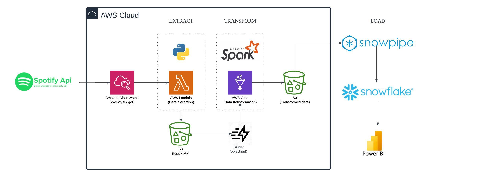

# Spotify Data Pipeline

## Introduction
The client is deeply passionate about the music industry and is interested in gaining insights into global music trends. They aim to start by collecting data on the top global songs from the Billboard charts.
The project involves building a data pipeline that can automatically collect and process data on top global songs from Billboard on a weekly basis. This will involve several key components, including data extraction, transformation, and storage.

## Objectives:

1. **Weekly Data Collection**: The client wants to automatically collect the top songs from the Billboard charts every week.
2. **Trend Analysis**: By tracking the top songs, artists, and albums over time, the client aims to understand what’s trending in the music industry.
3. **Year-End Analysis**: At the end of the year, the client wants to analyze the collected data to identify the song of the year, popular genres, and other significant trends.

## Future Goals:

- **Genre Popularity**: Analyze the popularity of different music genres over time.
- **Artist and Album Insights**: Gain deeper insights into which artists and albums have the most impact throughout the year.
- **Year-End Summary**: Generate reports summarizing key trends and findings, such as the song of the year.

## Architecture Diagram

This architecture is designed to be scalable, automated, and efficient, ensuring that the client receives up-to-date insights with minimal manual intervention.

## Technology Used
1. Programming Language - Python, PySpark
2. Scripting Language - SQL
3. AWS Platform
   - Lambda
   - Cloudwatch
   - S3
   - Glue
4. Data Warehouse - Snowflake and Snowpipe
   
## **Workflow Summary:**

1. **Extraction**: The process begins with CloudWatch triggering the AWS Lambda function, which extracts the top 50 songs data from the Spotify API and stores it as raw data in S3.
2. **Transformation**: AWS Glue processes the raw data, performing necessary transformations, and stores the transformed data in another S3 bucket.
3. **Loading**: Snowpipe detects the new transformed data and automatically loads it into Snowflake, where it is stored and organized for analysis.
4. **Visualization**: Finally, Power BI connects to Snowflake to allow data analysts to create visualizations and reports based on the data.

## Dataset Used
Using Spotify API that can be access on the Spotify Developer website.The top 50 songs globally can be accessed using the link https://open.spotify.com/playlist/37i9dQZEVXbMDoHDwVN2tF

## Documentation
See how I documented my process on building this pipeline here: https://skinny-key-516.notion.site/Spotify-Data-Pipeline-Project-d941261c3d764a2d854730b8bf0b72c0?pvs=4 
